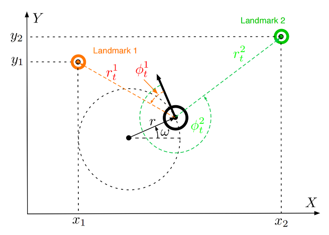
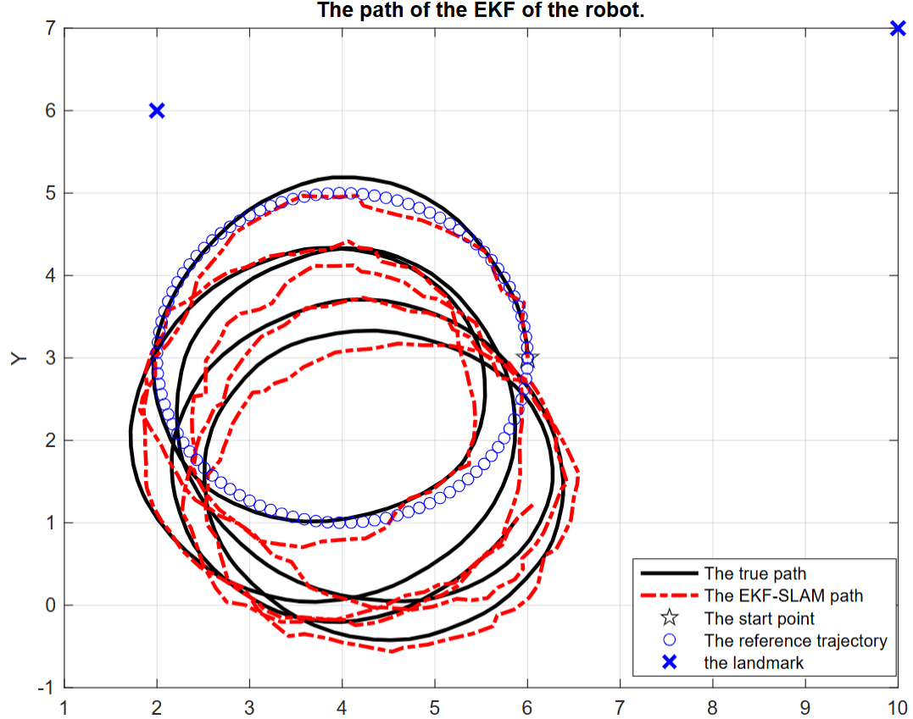
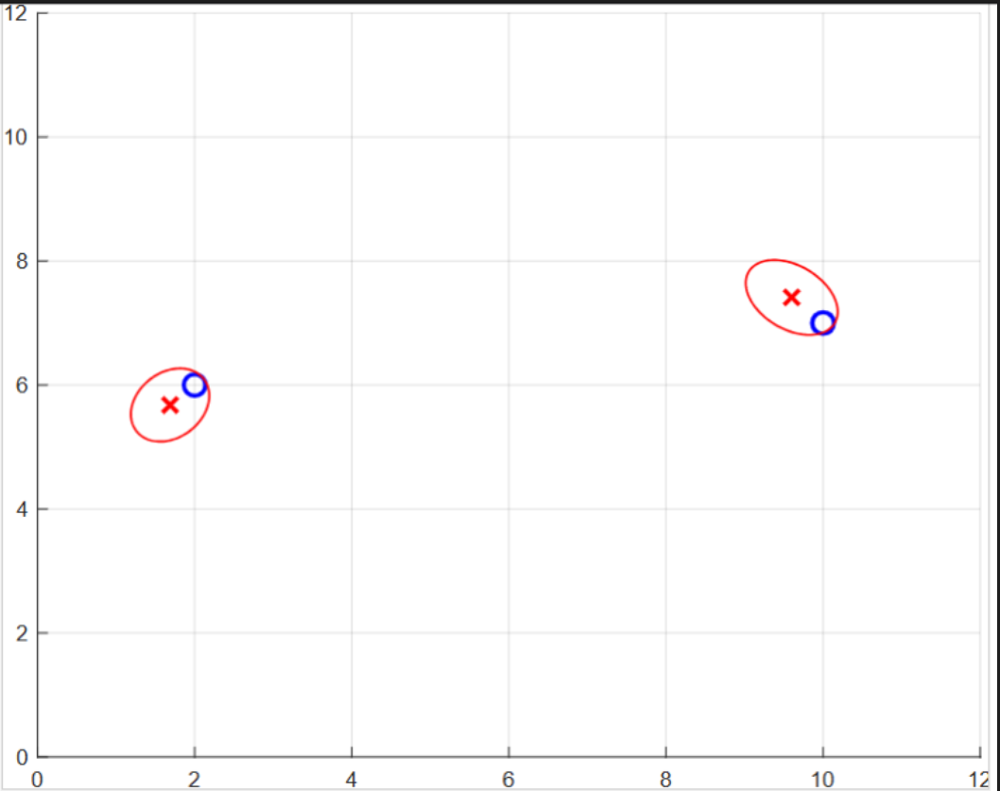

## 模型

机器人在时间 $t_0$ 的初始位姿坐标为 $(x_0,y_0,\theta_0)\coloneqq (6m,3m,\pi/2)$，机器人的平移速度 $\hat{v}_t$ 是一个正态分布的随机变量，均值为 $\mu_v=2 m/s$，协方差为 $\sigma_v^2=0.2(m/s)^2$。机器人的旋转速度 $\hat{\omega}_t$ 是一个正态分布的随机变量，均值为 $\mu_\omega=1$ rad/s，协方差为 $\sigma_\omega^2 = 0.1 (rad/s)^2$。

有两个路标，坐标分别为 $(x_1,y_1) \coloneqq (2m,6m)$ 和 $(x_2,y_2)\coloneqq (10m,7m)$，对机器人未知。

机器人以采样周期 $\Delta t = \textbf{0.1s}$ 测量到路标1和路标2的距离 $r_t^1, r_t^2$ 和方位角 $\phi_t^1,\phi_t^2$。

---

## 推导
EKF-SLAM同时估计两部分内容，分别是机器人的位置、姿态；还包含路标的位置信息$[x,y,\theta,x_1,y_1,x_2,y_2,\cdots]$,其中$[x_i,y_i]$是路标的信息。

通过对路标位置的估计既修正机器人的位置信息也修正路标的位置信息。

状态转移模型：
$$
	\begin{bmatrix}
		x_t\\
		y_t\\
		\theta_t\\
		\vdots
	\end{bmatrix} = \underbrace{\begin{bmatrix}
		x_{t-1}\\y_{t-1}\\\theta_{t-1}\\\vdots
	\end{bmatrix}+ 	\underbrace{ \begin{bmatrix}
		1 &0&0 &0&\cdots&0 \\
		0 &1&0 &0&\cdots&0 \\
		0 &0&1 &0&\cdots&0 
	\end{bmatrix}}_{F_x}\begin{bmatrix}
		-\frac{\hat{v_t}}{\hat{\omega_t}}\sin \theta_{t-1}+\frac{\hat{v_t}}{\hat{\omega_t}}\sin(\theta_{t-1}+\hat{\omega}_t\Delta_t)\\
		\frac{\hat{v_t}}{\hat{\omega_t}}\cos \theta_{t-1} -\frac{\hat{v_t}}{\hat{\omega_t}}\cos(\theta_{t-1}+\hat{\omega}_t \Delta_t) \\
		\hat{\omega} \Delta_t
	\end{bmatrix}}_{g(u_t,\mathbf{y}_{t-1})} + \mathcal{N}(0,R_t)
$$

无噪声格式：
$$
		y_t =g(u_t,y_{t-1})= y_{t-1} + F_x^T \begin{bmatrix}
		-\frac{\hat{v_t}}{\hat{\omega_t}}\sin \theta_{t-1}+\frac{\hat{v_t}}{\hat{\omega_t}}\sin(\theta_{t-1}+\hat{\omega}_t\Delta_t)\\
		\frac{\hat{v_t}}{\hat{\omega_t}}\cos \theta_{t-1} -\frac{\hat{v_t}}{\hat{\omega_t}}\cos(\theta_{t-1}+\hat{\omega}_t \Delta_t) \\
		\hat{\omega} \Delta_t
	\end{bmatrix}
$$

量测模型：
$$
	\begin{bmatrix}
		r_t^i\\
		\phi_t^i
	\end{bmatrix}=h(y_t,j) + \mathcal{N}(0,Q_t)= \begin{bmatrix}
		\sqrt{(m_{jx}-x_t)^2+(m_{jy}-y_t)^2}\\
		atan2 (m_{jy}-y_t,m_{jx}-x_t) -\theta_t
	\end{bmatrix} + \mathcal{N}(0,Q_t)
$$

1. $F_x = \begin{bmatrix}
		1& 0&0&0\cdots 0\\
		0& 1&0&0\cdots 0\\
		0& 0&1& \underbrace{0\cdots 0}_{2 N}
	\end{bmatrix}$
2. $\bar{\mu}_{t} = \mu_{t-1} + F_x^T\begin{bmatrix}
		-\frac{\hat{v_t}}{\hat{\omega_t}}\sin \theta_{t-1}+\frac{\hat{v_t}}{\hat{\omega_t}}\sin(\theta_{t-1}+\hat{\omega}_t\Delta_t)\\
		\frac{\hat{v_t}}{\hat{\omega_t}}\cos \theta_{t-1} -\frac{\hat{v_t}}{\hat{\omega_t}}\cos(\theta_{t-1}+\hat{\omega}_t \Delta_t) \\
		\hat{\omega} \Delta_t
	\end{bmatrix} $
3. $G_t = \mathbf{I}+F_x^T\begin{bmatrix}
		0&0 & -\frac{v_t}{\omega_t}\cos\theta_{t-1}+\frac{v_t}{\omega_t}\cos(\theta_{t-1}+\omega_t\Delta_t)\\
		0& 0& -\frac{v_t}{\omega_t}\sin\theta_{t-1}+\frac{v_t}{\omega_t}\sin(\theta_{t-1}+\omega_t\Delta_t)\\
		0&0 &0
	\end{bmatrix} F_x$
4. $\bar{\Sigma}_t = G_t\Sigma_{t-1}G_t^T +F_x^T R_t F_x$
5. $Q_t = \begin{bmatrix}
		\sigma_r^2 &0\\0&\sigma_\phi^2
	\end{bmatrix}$ 
6. for all observed feasures $z_t^i = (r_t^i, \phi_t^i)^T$ do
7.  $\quad j=c_t^i$
8. $\quad$ if landmark $j$ nerver seen before
9. $\quad \quad$ $\begin{bmatrix}
		\bar{\mu}_{j,x}\\\bar{\mu}_{j,y}
	\end{bmatrix} = \begin{bmatrix}
		\bar{\mu}_{t,x}\\\bar{\mu}_{t,y}
	\end{bmatrix} + \begin{bmatrix}
		r_t^i \cos(\phi_t^i + \bar{\mu}_{t,\theta})\\
		r_t^i \sin(\phi_t^i + \bar{\mu}_{t,\theta})
	\end{bmatrix}$
10. $\quad$ endif
11. $\quad$ $\delta = \begin{bmatrix}
		\delta_x\\\delta_y
	\end{bmatrix} = \begin{bmatrix}
		\bar{\mu}_{j,x} - \bar{\mu}_{t,x} \\
		\bar{\mu}_{j,y} - \bar{\mu}_{t,y} 
	\end{bmatrix}$
12. $\quad$ $q=\delta^2\delta$
13. $\quad$ $	\hat{z}_t^i = \begin{bmatrix}
		\sqrt{q}\\
		\text{atan2}(\delta_y,\delta_x) -\bar{\mu}_{t,\theta}
	\end{bmatrix} = h(\bar{\mu}_t)$
14. $\quad$ $	F_{x,j}=\begin{bmatrix}
		1&0&0& 0\cdots0 &0&0& 0\cdots0\\
		0&1&0& 0\cdots0 &0&0& 0\cdots0\\
		0&0&1& 0\cdots0 &0&0& 0\cdots0\\
		0&0&0& 0\cdots0 &1&0& 0\cdots0\\
		0&0&0& \underbrace{0\cdots0}_{2j-2} &0&1& \underbrace{0\cdots0}_{2N-2j}\\
	\end{bmatrix}$
15. $\quad$ $	H_t^i = \begin{bmatrix}
-\sqrt{q} \delta_{x} & -\sqrt{q} \delta_{y} & 0 & \sqrt{q} \delta_{x} & \sqrt{q} \delta_{y} & 0 \\
\delta_{y} & -\delta_{x} & -q & -\delta_{y} & \delta_{x} & 0 \\
0 & 0 & 0 & 0 & 0 & q
	\end{bmatrix}$
16. $\quad$ $K_t^i = \bar{\Sigma}_t H_t^{iT}[H_t^{i}\bar{\Sigma}_t H_t^{iT} + Q_t]^{-1}$
17. $\quad$ $\bar{\mu} = \bar{\mu}_t + K_t^i (z_t^i-\hat{z}_t^i)$
18. $\quad$ $\bar{\Sigma} = (I-K_t^iH_t^i)\bar{\Sigma}_t$
19. endfor
20. $\mu_t =\bar{\mu}_t$
21. $\Sigma_t = \bar{\Sigma}_t$
22. returen $\mu_t,\Sigma_t$

---
## 仿真结果

